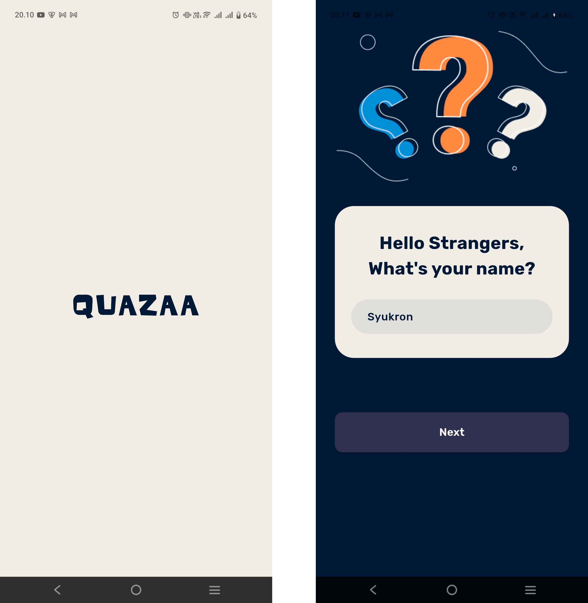
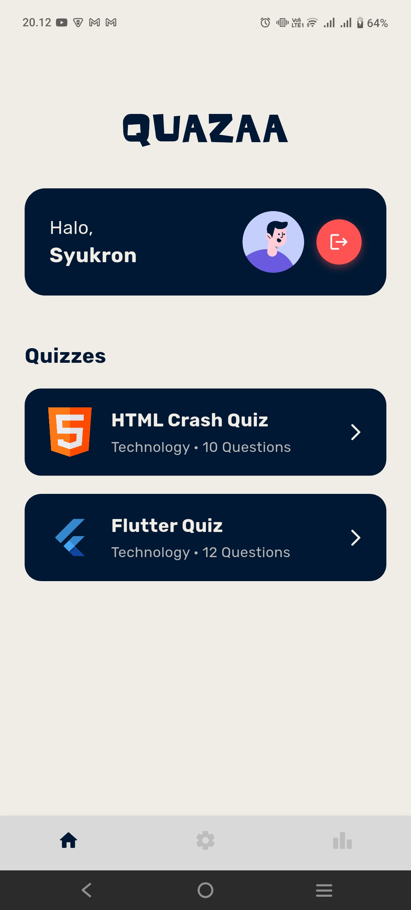
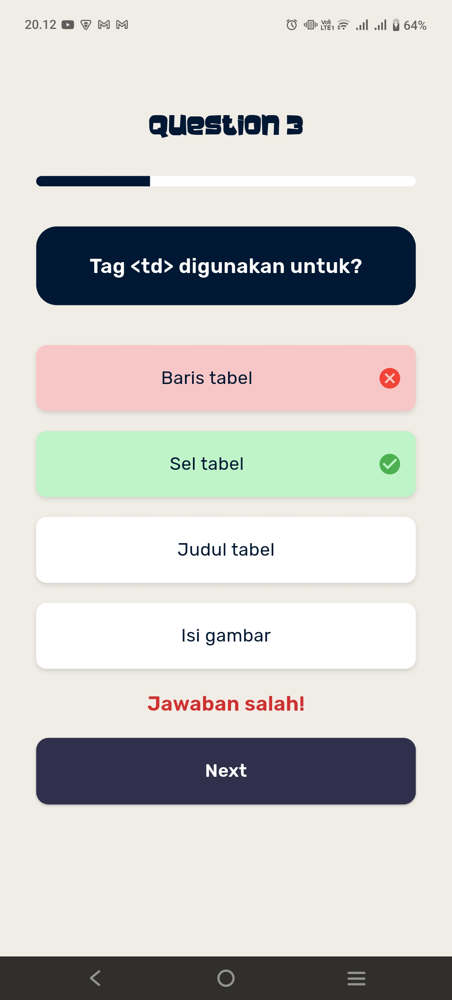
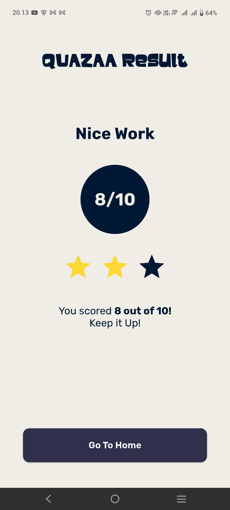
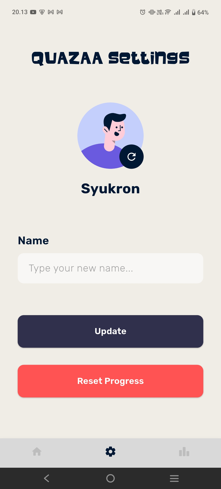
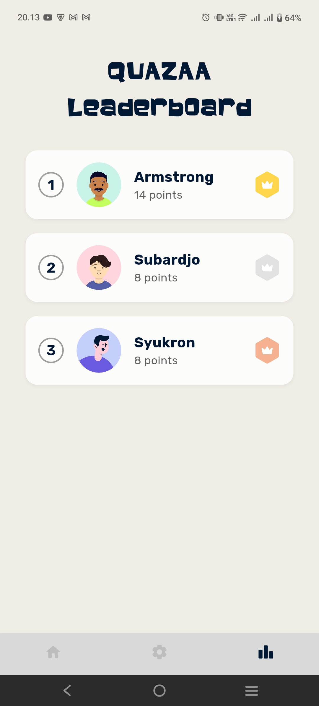

# Introduction

Nama : Muhammad Syukron Jazila  
NIM : 231401007  
Lab : 1

---

# App Name

**Quazaa**

---

# App Description

**Quazaa** adalah aplikasi kuis edukatif interaktif yang dirancang untuk menguji pengetahuan pengguna dalam berbagai bidang seperti teknologi, bahasa pemrograman, dan logika.  
Aplikasi ini menggabungkan tampilan modern, transisi animatif yang halus, dan sistem skor real-time untuk memberikan pengalaman belajar yang seru namun tetap menantang.

Pengguna dapat memilih berbagai kategori kuis seperti **HTML Crash Quiz**, **Flutter Quiz**, dan kategori lainnya yang akan dikembangkan selanjutnya seperti **JavaScript** dan **UI/UX Design**.  
Setiap kategori memiliki kumpulan pertanyaan unik lengkap dengan gambar ilustratif untuk membantu pemahaman konsep.

---

# Source Credit

Terima kasih kepada berbagai desainer dan kreator komunitas yang menjadi inspirasi dalam perancangan antarmuka aplikasi **Quazaa**:

| No | Sumber Inspirasi | Keterangan |
| -- | -------------------------------------------------------------------------------------------------------------------------------- | ------------------------------------------------ |
| 1 | [Figma – Quiz App (Community)](https://www.figma.com/design/srTlIlMJRsY890HMiR9cXN/Quiz-App---Generation--Community-) | Inspirasi desain awal |
| 2 | [Figma – Modern Quiz App UI Design](https://www.figma.com/design/EddLyM9qAZ6qaGgcPkv7Ej/Modern-Quiz-App-UI-Design-%E2%80%93-Clean---Interactive--Community-) | Referensi foto profil di aplikasi dan tampilan leaderboard|
| 3 | [Dribbble – Quiz Game App](https://dribbble.com/shots/23429537-Quiz-Game-App) | Inspirasi palet warna |
| 4 | [Figma Community File](https://www.figma.com/community/file/1388742897600023965) | Referensi halaman Home dan halaman Result |

---

# Screenshot App

Berikut adalah tampilan antarmuka dari aplikasi **Quazaa**, mulai dari layar pembuka hingga layar hasil akhir.

---

## 🟣 Tampilan Awal

- **Splashscreen** menampilkan logo **Quazaa** dengan animasi fade-in sederhana, memberikan kesan modern dan edukatif.
- **Input Nama**: pengguna diminta memasukkan nama sebelum memulai kuis, agar skor dapat disimpan secara personal.

---

## 🧠 Tampilan Halaman Home

- **Home Screen**: menampilkan daftar kategori kuis seperti **HTML Crash Quiz** dan **Flutter Quiz**, masing-masing disertai gambar, jumlah soal, dan kategori bidangnya.
- Tiap kategori berbentuk **card interaktif** berisi gambar, nama kuis, dan jumlah soal.
- Ketika diklik, pengguna akan diarahkan ke halaman quiz.

---

## 📘 Tampilan Quiz

- **Pertanyaan** ditampilkan satu per satu, dengan opsi jawaban yang dapat diklik.
- Setiap soal dapat memiliki **gambar ilustrasi pendukung** seperti tampilan UI
- **Efek visual**:
  - Pilihan benar → warna **hijau** dengan efek animasi “bergetar halus”.
  - Pilihan salah → warna **merah** dengan animasi “shake” ringan.

---

## 🏁 Tampilan Hasil

- Menampilkan total soal, jumlah jawaban benar, dan **rating bintang (⭐️)** berdasarkan performa:
  - 1 bintang per ⅓ total soal benar.
  - Contoh: dari 15 soal, jika benar 10 → ⭐️⭐️.
- Tombol  **Go To Home** untuk kembali ke halaman utama.

---

## ⚙️ Tampilan Settings

- Pengguna dapat mengubah **nama**, mengubah **foto profile** secara acak, serta **reset progress** quiz.
---

## 🏆 Tampilan Leaderboard

- Menampilkan **peringkat pemain berdasarkan skor tertinggi**.
- Tiga besar diberi warna khusus:
  - 🥇 Emas (1)
  - 🥈 Perak (2)
  - 🥉 Perunggu (3)

---

# 🧩 Fitur Utama

- 🔹 **Multi-Kategori Quiz**: HTML, Flutter, dan lainnya.
- 🔹 **Gambar Pendukung Soal**: bantu pengguna memahami konteks pertanyaan.
- 🔹 **Skor & Progres Real-Time**: langsung diperbarui setelah tiap jawaban.
- 🔹 **Animasi Lembut & Modern**: menambah interaktivitas tanpa mengganggu fokus.
- 🔹 **Akses Mudah & Ringan**: tanpa login rumit, langsung bermain.

---

# 🎨 Link Mockup Design

Kamu dapat melihat rancangan desain lengkap aplikasi **Quazaa** di Figma melalui tautan berikut:

👉 [https://www.figma.com/design/ZWgKLyP7KGNQZDMrUjFlUL/Quazaa?node-id=2035-804&t=CLD8iguyOqN3UmV8-0](https://www.figma.com/design/ZWgKLyP7KGNQZDMrUjFlUL/Quazaa?node-id=2035-804&t=CLD8iguyOqN3UmV8-0)

